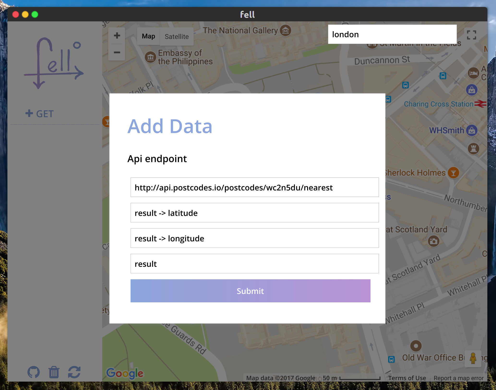
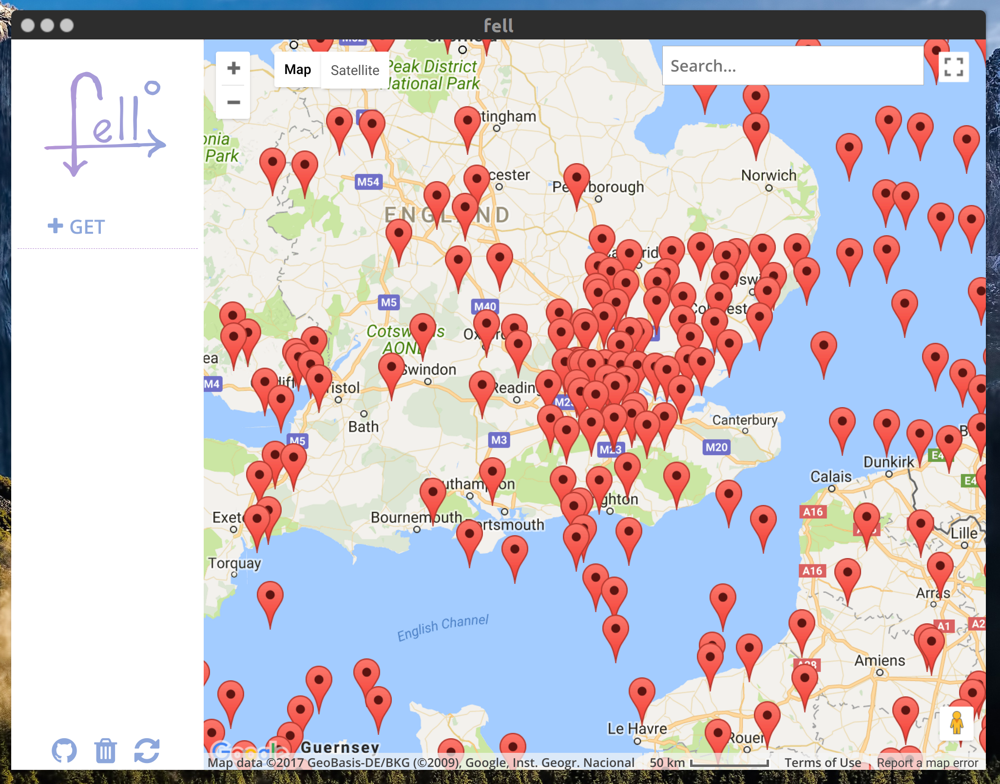

# fell

## Debug Geo APIs like a real human

Inspired by the best REST clients on the market fell aim's to be a api debug and data exploration tool for Geo location data. The purpose of fell is to provide a quick and powerful interface to visualise latitude and longitude data.

Based on REST requests fell will fetch, parse and display data in two click.

## AxisLang parsing

One of the major challenges of developing an application like fell is that you cannot expect every single form of input. So to achieve the goal of quick and versatile parsing of data structures fell uses [Axis](https://github.com/pedsm/axisLang) syntax, specifically designed to allow fell to perform at its best.

## All the information you will ever need

fell is not only a data exploration tool but it is designed for debugging and API development, what means that it will always try to provide you with as much information as possible.

### Example queries
| url | lat | lon | body |
| --- | --- | ----| ---- |
| https://public-api.adsbexchange.com/VirtualRadar/AircraftList.json?lat=33.433638&lng=-112.008113&fDstL=0&fDstU=100 | acList -> Lat | acList -> Long | acList |
| https://api.postcodes.io/postcodes/wc2n5du | result -> latitude | result -> longitude | result |
| https://api.postcodes.io/postcodes/wc2n5du/nearest | result -> latitude | result -> longitude | result |

### A brief introduction to AxisLang

Designed specifically to meet the demands of fell Axis a querying syntax for data extraction. The key component of Axis it is ambiguity, Axis is designed to have an ambiguous syntax, as the query is not strictly based on the query but also takes in consideration the data. This means that the same syntax can potentially be reused. More on [axis ambiguity](https://github.com/pedsm/axisLang)

